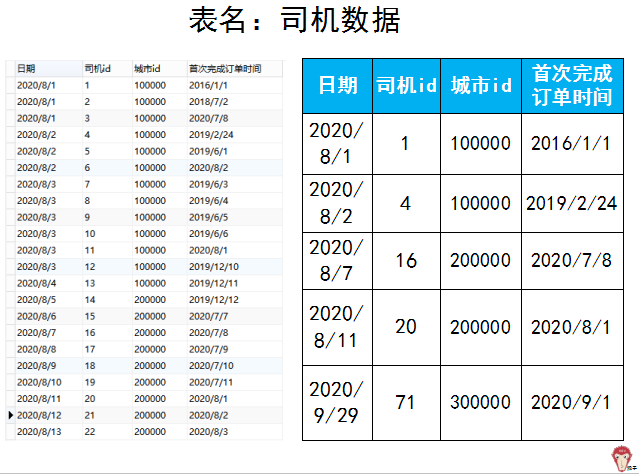
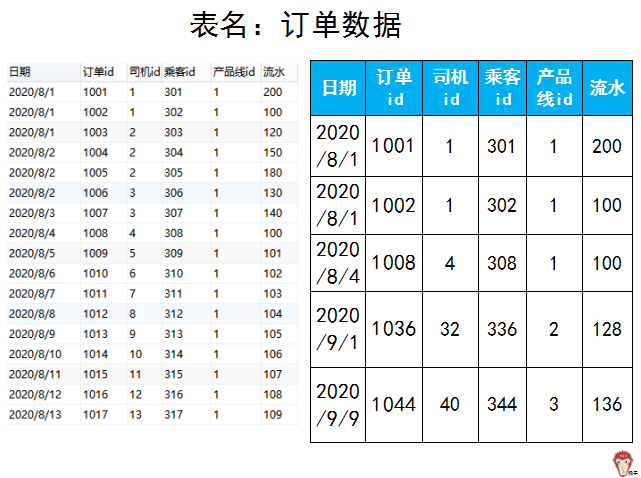
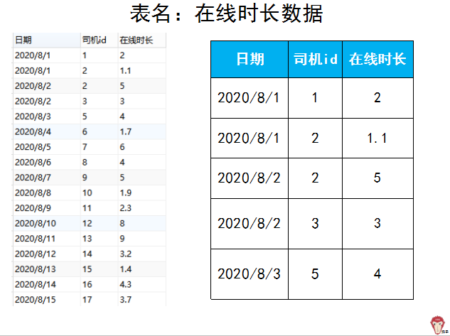
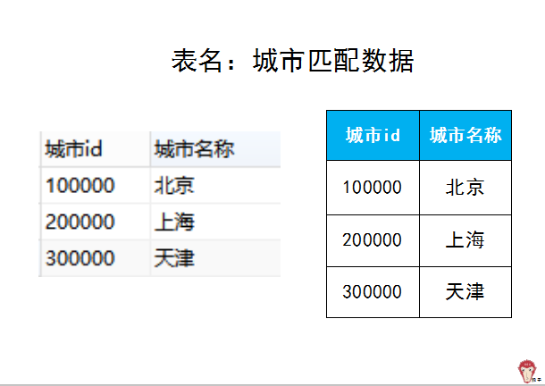
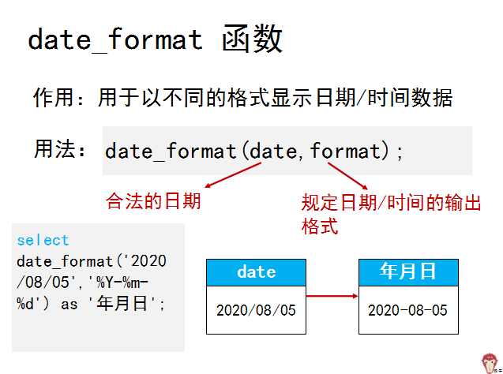

# **滴滴面试题：打车业务问题如何分析？**


**【题目】**

公司的 app（类似滴滴、uber）为用户提供打车服务。现有四张表，分别是 “司机数据” 表，“订单数据”表，“在线时长数据”表，“城市匹配数据”表。（滴滴面试题）

下图左表是 “司机数据” 表的部分数据。为了便于讲解，之后在涉及到表的时候，用下图右表来代替。右表中展示了左表的部分代表性数据。





上表中的 “产品线 id”: 1 是表示专车，2 表示企业，3 表示快车，4 表示企业快车





**业务问题**

1. 分析出 2020 年 8 月各城市每天的司机数、快车订单量和快车流水数据。

2. 分析出 2020 年 8 月和 9 月，每个月的北京市新老司机（首单日期在当月为新司机）的司机数、在线时长和 TPH（订单量 / 在线时长）数据。

3. 分别提取司机数大于 20，司机总在线时长大于 2 小时，订单量大于 1，乘客数大于 1 的城市名称数据。

（文末有模拟数据下载）

**【解题思路】**  

为了方便数据处理，首先将这些表中所有的日期数据转化为日期格式 ‘年 - 月 - 日’ 的形式。需要使用 date_fromat 函数。



sql 语句为

```MYSQL
update 司机数据 
set 日期=date_format(日期,'%Y-%m-%d');
update 司机数据 
set 首次完成订单时间=date_format(首次完成订单时间,'%Y-%m-%d');
update 订单数据 
set 日期=date_format(日期,'%Y-%m-%d');
update 在线时长数据 
set 日期=date_format(日期,'%Y-%m-%d');

```

处理后的表如下图，可以发现对应日期列已经修改过来了。


接下来看需要分析的业务问题。  

**1. 提取 2020 年 8 月各城市每天的司机数、快车订单量和快车流水数据。**

**(1) 2020 年 8 月各城市每天的司机数**

**使用[逻辑树分析方法](http://mp.weixin.qq.com/s?__biz=MzAxMTMwNTMxMQ==&mid=2649246563&idx=2&sn=3ffe509999d144d23dec5acc101fc2ef&chksm=835fc353b4284a45ce01391453fe2fec1b225bbd6bbdb67dd7f304aacdd4f21f60d0b27ba309&scene=21#wechat_redirect)，拆解业务需求的每个部分。**

**“2020 年 8 月”**，可以用 between and 函数来对时间进行条件限制。

**“每天的司机数”**，司机数的计算用到的表是 “司机数据” 表。当出现 “每天” 要想到《猴子 从零学会 sql》里讲过的分组汇总，来解决 “每天” 这样的问题。用“日期“来分组（group by），用 count(司机 id) 来汇总司机数。

**“各城市”**，城市在 “城市匹配数据“表中。也就是“每个城市” 所以用 “城市 “来分组（group by）。

这里涉及到两个表 “司机数据” 表和 “城市匹配数据 “表，所以遇到多表查询的情况，要想到[《猴子 从零学会 sql》](http://mp.weixin.qq.com/s?__biz=MzAxMTMwNTMxMQ==&mid=2649247566&idx=2&sn=5af748b677eb72028764dde0577675fb&chksm=835fc77eb4284e68e8cfe3f08c5a671b9e080b2651f20b40b1c793ffda4042ae43ad8f35a755&scene=21#wechat_redirect)里讲过的多表联结。下图是两表联结的条件（通过城市 id 联结）。


使用哪种联结呢？

因为要查询的是司机数，所以要保留 “司机数据” 表中的全部数据，因此使用左联结。

sql 语句如下  


查询结果如下图 (部分展示)  


**(2) 2020 年 8 月各城市每天的快车订单量**

**“2020 年 8 月”**，可以用 between and 函数来对时间进行条件限制。

**“每天的快车订单量”**，对于计算快车订单量，用到的表是 “订单数据” 表。根据题目的字段解释，“产品线 id”: 1 是表示专车，2 表示企业，3 表示快车，4 表示企业快车。可以用 where 子句把快车数据先筛选出来（产品线 id=3）。

当出现 “每天” 要想到《猴子 从零学会 sql》里讲过的分组汇总，来解决 “每天” 这样的问题。用“日期“来分组（group by），用 count(订单 id) 来汇总订单量。  

**“各城市”**，城市在 “城市匹配数据 “表中。也就是 “每个城市” 所以用 “城市 “来分组（group by）。

在 “订单数据” 表、“司机数据” 表中都没有城市数据，所以需要三表联结，下面是 3 表的关系图。


使用哪种联结呢？

因为要查询的是快车订单量，所以要保留 “订单数据” 表中的全部数据，因此使用左联结来与 “司机数据” 进行联结（联结依据为 “司机 id”）。然后，因为要对第一次联结后的表的“城市 id” 与“城市名称”进行匹配，所以我们用左联结来进行匹配。

sql 语句如下  


查询结果如下图  


**(3) 2020 年 8 月各城市每天的快车流水数据**

**“2020 年 8 月”**，可以用 between and 来对时间进行条件限制。

**“每天的快车流水数据”**，对于计算快车订单量，用到的表是 “订单数据” 表。根据题目的字段解释，“产品线 id”: 1 是表示专车，2 表示企业，3 表示快车，4 表示企业快车。可以用 where 子句把快车数据先筛选出来（产品线 id=3）。

当出现 “每天” 要想到《猴子 从零学会 sql》里讲过的分组汇总，来解决 “每天” 这样的问题。用“日期“来分组（group by），用 sum(流水) 来汇总流水。  

**“各城市”**，城市在 “城市匹配数据“表中。也就是“每个城市” 所以用“城市“来分组（group by）。

在 “订单数据” 表、“司机数据” 表中都没有城市数据，所以需要三表联结，下面是 3 表的关系图。  


使用哪种联结呢？

因为要查询的是快车流水量，所以要保留 “订单数据” 表中的全部数据，因此使用左联结来与 “司机数据” 进行联结（联结依据为 “司机 id”）。然后，因为要对第一次联结后的表的“城市 id” 与“城市名称”进行匹配，所以我们用左联结来进行匹配。

sql 语句如下


查询结果如下  


**2. 提取 2020 年 8 月和 9 月，每个月的北京市新老司机（首单日期在当月为新司机）的司机数、在线时长和 TPH（订单量 / 在线时长）数据。**

我们将新老司机分开来分析，先针对新司机进行提取，然后老司机同理可得。  

****（1）提取 2020 年 8 月和 9 月，每个月的北京市新司机的司机数。****

使用[多维度拆解分析方法](http://mp.weixin.qq.com/s?__biz=MzAxMTMwNTMxMQ==&mid=2649246563&idx=2&sn=3ffe509999d144d23dec5acc101fc2ef&chksm=835fc353b4284a45ce01391453fe2fec1b225bbd6bbdb67dd7f304aacdd4f21f60d0b27ba309&scene=21#wechat_redirect)来拆解题目为以下子问题：  

> 1）每个月的司机数
> 
> 2）条件：新司机
> 
> 2）时间条件：2020 年 8 月和 9 月
> 
> 3）城市条件：北京市

**先来看子问题 1：每个月的司机数**

对于司机数的计算，用到 “司机数据” 表。根据《猴子 从零学会 sql》里讲过的，遇到 “每个” 这类型问题要用分组汇总。“每个月” 按月份分组（group by），用 count(司机 id) 来汇总司机数。

```MYSQL
select count(司机id) as 司机数
from 司机数据
group by 月份；

```

这里的月份怎么得到呢？

可以通过 “日期” 列获得：date_format(日期,'%Y-%m')

所以，上面 sql 修改为：  

```MYSQL
select count(司机id) as 司机数
from 司机数据
group by date_format(日期,'%Y-%m') as 月份；

```

**子问题 2，条件：新司机**

对于 ‘新司机’ 这个条件，由题目中的释义可知：首单日期在当月为新司机。因此我们通过比较 "日期" 与 “首次完成订单日” 两列的年月 相等的，即为新司机。

我们用函数 year(日期) 来提取日期中的年份。用函数 month(日期) 来提取日期中的月份。

利用如下 “where” 条件来表示新司机。  

```MYSQL
where year(首次完成订单时间)=year(日期) 
and month(首次完成订单时间)=month(日期) 

```

加入 “新司机” 条件后的 sql 如下：  

```MYSQL
select count(司机id) as 新司机数
from 司机数据
where year(首次完成订单时间)=year(日期) 
and month(首次完成订单时间)=month(日期) 
group by date_format(日期,'%Y-%m') as 年月；

```

**子问题 3，时间条件：2020 年 8 月和 9 月**

利用 where 加条件，between...and 函数限制时间范围。

```MYSQL
where 日期 between '2020-08-01' and '2020-08-31'
or 日期 between '2020-09-01' and '2020-09-31'

```

```MYSQL
select count(司机id) as 新司机数
from 司机数据
where year(首次完成订单时间)=year(日期) 
and month(首次完成订单时间)=month(日期) 
and (日期 between '2020-08-01' and '2020-08-31'
or 日期 between '2020-09-01' and '2020-09-31')
group by date_format(日期,'%Y-%m') as 年月；

```

**子问题 4，城市条件：北京市**

利用 where 添加城市条件，城市 id 等于北京市的 id。

```MYSQL
where 城市id ='100000'

```

最终 sql 如下


查询结果如下  


**(2) **提取 2020 年 8 月和 9 月，每个月的北京市新司机的在线时长。****

对于在线时长的计算，用到 “在线时长数据” 表。根据《猴子 从零学会 sql》里讲过的，遇到 “每个” 这类型问题要用分组汇总。“每个月” 按月份分组（group by），在线时长的总长利用 sum(在线时长) 来计算。

而我们发现新司机在 “在线时长数据” 表 中并没有，而是在 “司机数据” 表 中通过查询语句才能得到，因此我们用两个表的联结，得到 8,9 月北京新司机的在线时长，然后再利用子查询，使用 sum(在线时长) 得到总时长。

sql 语句解析如下  


查询结果如下  


(3) **提取 2020 年 8 月和 9 月，每个月的北京市新司机的 TPH（订单量 / 在线时长）。**

由题可知，TPH = 订单量 / 在线时长。其中在线时长我们在上一题中已经求得，因此只需求出订单量即可。

订单量的计算，会用到 “订单数据” 表，用 count(订单 id) 来计算。然后思路与上题一样，新司机在 “在线时长数据” 表中并没有，而是在 “司机数据” 表 中通过查询语句才能得到。

因此我们用两个表的联结，得到 8,9 月北京新司机的在线时长，然后再利用子查询，使用 count(订单 id) 得到总订单量。

sql 语句解析如下


查询结果如下  


因此，2020 年 8 月和 9 月，每个月的北京市新司机的 TPH = 订单量 / 在线时长 = 2/4=0.5。

对于老司机的司机数，在线时长以及 TPH，同理可得，只需要将 “新司机” 的条件 换成 “老司机” 即可，其他语句都不变。


**3. 分别提取司机数大于 20，司机总在线时长大于 2 小时，订单量大于 1，乘客数大于 1 的城市名称数据。**

**(1)** **司机数大于 20 的城市名称。**

司机数的计算用 count(司机 id)，用到的是 “司机数据” 表，城市名称在 “城市匹配数据”中，用表的联结。联结图如下。


sql 语句解析如下


查询结果如下  


**(2)** **司机总在线时长大于 2 小时城市名称。**

总在线时长用 sum(在线时长)来计算，用的是 “在线时长数据”表，而这个表中没有城市 id，因此我们需要先联结 “司机数据” 表，得到城市 id，再通过联结 “城市匹配数据” 表，得到对应的城市名称。


sql 语句解析如下  


查询结果如下  


**(3) 订单量大于 1 的城市名称。**

订单量的计算用 count(订单 id)，乘客数的计算用 count(乘客 id)，用到的表为 “订单数据表”，而这个表中没有城市 id。

我们需要先通过 “司机数据” 表联结，得到对应的城市 id，在通过 “城市匹配数据” 表进行联结，得到相应的城市名称。


sql 语句解析如下  


查询结果如下  


**(4) 乘客数大于 1 的城市名称。**

乘客数通过 count(乘客 id)来计算，用到的表为 “订单数据” 表，而这个表中并没有城市 id，所以我们需要联结 “司机数据”表来得到相应的城市 id，再通过 “城市匹配数据” 联结，得到相应的城市名称。  

sql 语句解析如下  


查询结果如下  


**【本题考点】**

1. 这次试题重点要考察的是表的联结。当题目中涉及到多个表之间的关系时，我们要找到多个表之间是通过什么条件关联的，然后进行多表关联。

2. 考查如何将复杂问题拆解为简单问题的能力，可以使用[逻辑树分析方法](http://mp.weixin.qq.com/s?__biz=MzAxMTMwNTMxMQ==&mid=2649246563&idx=2&sn=3ffe509999d144d23dec5acc101fc2ef&chksm=835fc353b4284a45ce01391453fe2fec1b225bbd6bbdb67dd7f304aacdd4f21f60d0b27ba309&scene=21#wechat_redirect)。

3. 如何下载案例数据？


推荐：[如何从零学会 sql？](http://mp.weixin.qq.com/s?__biz=MzAxMTMwNTMxMQ==&mid=2649247566&idx=2&sn=5af748b677eb72028764dde0577675fb&chksm=835fc77eb4284e68e8cfe3f08c5a671b9e080b2651f20b40b1c793ffda4042ae43ad8f35a755&scene=21#wechat_redirect)

[](http://mp.weixin.qq.com/s?__biz=MzAxMTMwNTMxMQ==&mid=2649247566&idx=2&sn=5af748b677eb72028764dde0577675fb&chksm=835fc77eb4284e68e8cfe3f08c5a671b9e080b2651f20b40b1c793ffda4042ae43ad8f35a755&scene=21#wechat_redirect)
